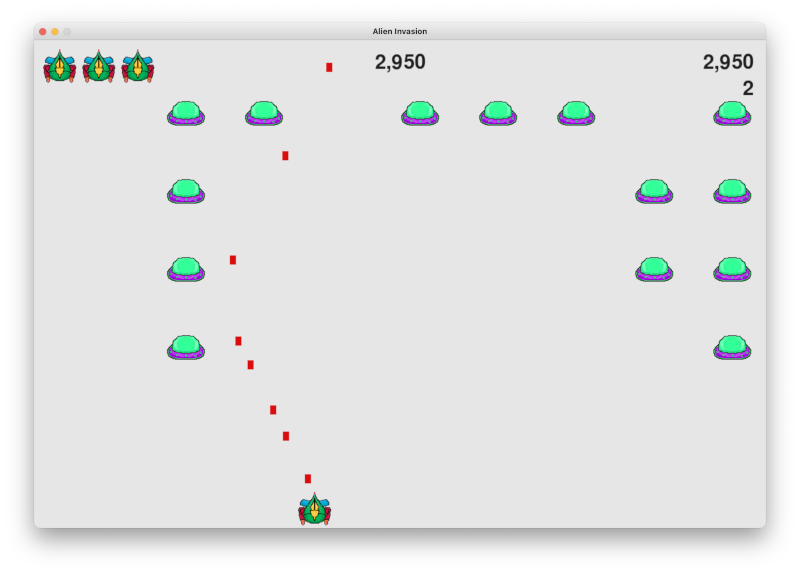

# Alien Invasion
- This is my first python project, using python and pygame module
- I made this project around January 2021.

- [Alien Invasion](#alien-invasion)
  - [Game Description](#game-description)
  - [Objectives](#objectives)
  - [Game Controls](#game-controls)
  - [In game images](#in-game-images)
  - [Reference](#reference)

## Game Description
- In Alien Invasion, the player controls a rocket ship that appears at the bottom
of the screen. The player can move the ship right and left using the arrow keys
and shoot bullets using the spacebar. When the game begins, a fleet of aliens
fills the sky and moves across and down the screen. The player shoots and
destroys the aliens. If the aliens hits the player's ship or reaches the bottom
of the screen, the player loses a ship. If the player loses three ships,
it is game over.

## Objectives
- Shoot down all the aliens to process to the next level.
- Each level will increase enemies movement
- Collect as much coins as you can

## Game Controls
- arrows keys to move left and right
- space bar to shoot
- press Q to exit the game

## In game images

## Reference
- Python Crash Course 2e by Eric Matthes
